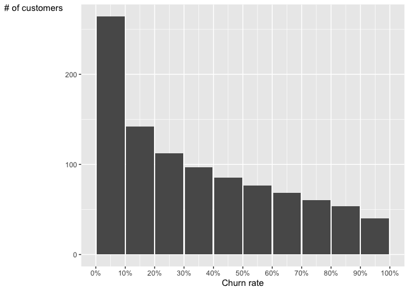
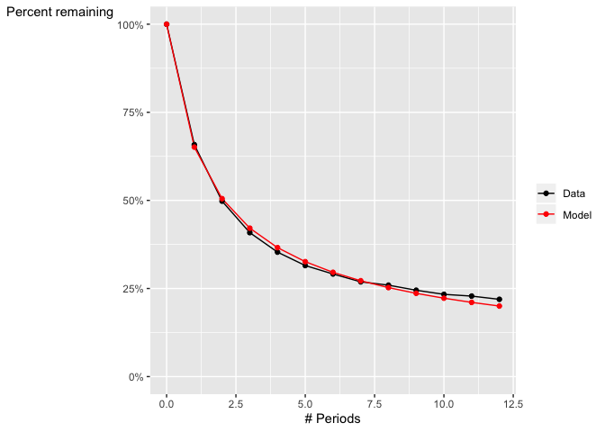

<!-- README.md is generated from README.Rmd. Please edit that file -->

# clovers

<!-- badges: start -->

<!-- badges: end -->

The clovers package implements Fader and Hardie’s Shifted Beta Geometric
model for LTV in a discrete-time, contractual business.

## Installation

Once this package is available on CRAN, it can be installed as follows:

``` r
install.packages("clovers")
```

## Example

This is a basic example:

``` r
library(clovers)
```

The package comes with simulated customer-level data:

``` r
data(customer_lifetimes)
head(customer_lifetimes)
#>   t is_active
#> 1 1         0
#> 2 3         0
#> 3 1         0
#> 4 1         0
#> 5 3         0
#> 6 2         0
```

Aggregate the customer-level data to the format required by the fitting
function:

``` r
agg_data = transform_individual(customer_lifetimes)
print(agg_data)
#>     t n_churn n_survive
#> 1   1     342        62
#> 2   2     145        39
#> 3   3      74        35
#> 4   4      41        30
#> 5   5      25        23
#> 6   6      14        26
#> 7   7      11        19
#> 8   8       4        20
#> 9   9       5        22
#> 10 10       3        13
#> 11 11       1        21
#> 12 12       1        24
```

Fit the model to the aggregated data and print the resulting fit
parameters:

``` r
fit = fit_sbg(agg_data)
print(fit)
#> $a
#> [1] 0.6312271
#> 
#> $b
#> [1] 1.17828
```

Display the modeled mean lifetime:

``` r
lifetime_stats(fit)
#> $mean_lifetime
#> [1] 8.129852
#> 
#> $sd_lifetime
#> [1] 11.4308
```

Plot the modeled distribution of churn rates:

``` r
plot_churn_distribution(fit, type="count")$plot
```



Draw a plot comparing the modeled survival function to an empirical
survival function computed with the Kaplan-Meier estimator:

``` r
plot_model_fit(fit, agg_data)$plot
```


